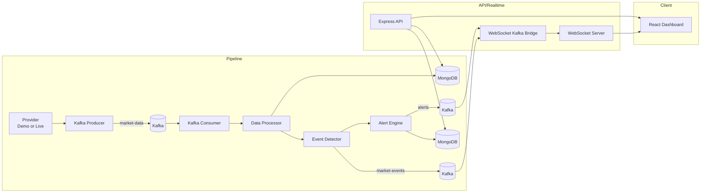

# FinPulse

An India-focused, event-driven financial analytics platform. Market data flows through Apache Kafka end-to-end — there is no path from data source to database that skips the event bus.

## Overview

FinPulse simulates (or, with credentials, ingests live) NSE price ticks for eight tracked instruments, streams them through Kafka, detects significant market movements with a rule engine, persists everything to MongoDB, and pushes real-time updates to a React dashboard over WebSocket. Every monetary value in the UI is INR, formatted with Indian digit grouping (₹1,25,000).

## Features

- Real event-driven pipeline: **Provider → Kafka producer → `market-data` topic → Kafka consumer → MongoDB → event detector → `market-events` topic → alert engine → `alerts` topic → WebSocket → React**
- Demo market simulator (clearly labeled `DEMO`) and a pluggable live-provider adapter (clearly labeled `LIVE`) — the app never presents simulated data as live
- Rule-based event detection: PRICE_SPIKE, PRICE_DROP, HIGH_VOLUME, NEW_HIGH, NEW_LOW, PRICE_TARGET
- Alert engine with user-defined alert rules, idempotent via a unique index on `eventId`
- JWT authentication, per-user portfolios/watchlists/alert rules
- Portfolio tracking with a real MongoDB transaction on buy/sell so quantity + average price + the transaction record stay consistent
- Dashboard, stock detail page with an interactive price chart, portfolio, analytics, watchlist, and alert-rule management pages
- Dark, ledger-inspired UI with a marigold accent, tabular figures for all prices

## Architecture



## MERN + Kafka Architecture

- **MongoDB** — system of record for stocks, market data, events, alerts, alert rules, portfolios, positions, transactions, watchlists, and users.
- **Express.js** — `server/` exposes the REST API under `/api/v1`, handles auth, and hosts the WebSocket server.
- **React** — `client/` is the dashboard (Vite + TypeScript + Tailwind + Recharts).
- **Node.js** — runs everywhere: the Express server, and the two standalone pipeline services.
- **Apache Kafka** — the event bus. `pipeline/producer` and `pipeline/consumer` are separate Node.js processes/containers, not functions bolted onto Express.

## Technology Stack

| Layer | Choices |
|---|---|
| Frontend | React, Vite, TypeScript, Tailwind CSS, Recharts, Axios, native WebSocket |
| Backend | Node.js, Express.js, TypeScript, Mongoose |
| Database | MongoDB |
| Event streaming | Apache Kafka via KafkaJS |
| Infra | Docker, Docker Compose |

## Project Structure

```
FinPulse/
├── client/          React dashboard (Vite + TS + Tailwind)
├── server/          Express API + WebSocket + Kafka bridge
├── pipeline/        Kafka producer + consumer + event detection
├── shared/          Mongoose models, Kafka client, event types, finance math
│                    (imported by BOTH server and pipeline — never duplicated)
├── docker-compose.yml
├── .env.example
└── package.json     npm workspaces root
```

`shared/` is why there is only one definition of each Mongoose model and one event-detection rule engine, even though three separate Node.js processes (server, producer, consumer) need them.

## MongoDB Schema

| Collection | Key indexes |
|---|---|
| User | `email` (unique) |
| Stock | `symbol + exchange` (unique), `symbol` |
| MarketData | `symbol + timestamp`, `stock + timestamp` |
| Event | `eventId` (unique), `symbol + timestamp`, `eventType + timestamp`, `severity + timestamp` |
| Alert | `eventId` (unique — idempotency), `symbol + triggeredAt`, `isRead` |
| AlertRule | `user + isActive`, `symbol + isActive` |
| Portfolio / PortfolioPosition / Transaction | `portfolio + stock` (unique on position) |
| Watchlist / WatchlistItem | `watchlist + stock` (unique) |

## Kafka Topics

| Topic | Producer | Consumer(s) | Payload |
|---|---|---|---|
| `market-data` | pipeline producer | pipeline consumer | `MarketDataEvent` (raw tick) |
| `market-events` | pipeline consumer (after detection) | server's WebSocket bridge | `MarketDetectedEvent` |
| `alerts` | pipeline alert engine | server's WebSocket bridge | `AlertEvent` |
| `market-data-dlq` | pipeline consumer | (inspect manually) | malformed/failed messages + reason |

Schemas live in `shared/types/events.ts` with a runtime validator (`validateMarketDataEvent`) — the producer never publishes a message that fails validation, and the consumer routes anything malformed to the DLQ instead of crashing.

## Data Pipeline

1. **Provider** (`pipeline/src/providers`) — `DemoMarketDataProvider` generates realistic ticks for RELIANCE, TCS, INFY, HDFCBANK, ICICIBANK, SBIN, ITC, LT (90% small moves, 10% larger moves so event detection has something to detect). `LiveMarketDataProvider` is a real, wired-up REST adapter, used automatically once `MARKET_DATA_API_KEY` + `MARKET_DATA_API_URL` are set — adapt `parseResponse()` to your actual vendor's response shape first.
2. **Producer** (`pipeline/src/producer`) — polls the provider every `MARKET_DATA_INTERVAL_SECONDS`, validates, publishes to `market-data`, retries transient failures, shuts down gracefully on SIGINT/SIGTERM.
3. **Consumer** (`pipeline/src/consumer`) — deserializes, validates (routing invalid JSON/schema failures to the DLQ), and only returns from the message handler — which is what allows the offset to advance — after MongoDB persistence and Kafka publishing of derived events have both succeeded. Up to 3 retries on transient failures before a message goes to the DLQ.
4. **Processor** (`pipeline/src/processors/dataProcessor.ts`) — upserts the Stock, stores the MarketData tick (skipping exact duplicates), builds detection context (recent average volume, historical high/low) from MongoDB, and runs the rule engine.
5. **Event detector** (`pipeline/src/processors/eventDetector.ts`) — a pure, unit-tested function; both the pipeline and the tests are the only consumers of this logic, so thresholds are never duplicated elsewhere.
6. **Alert engine** (`pipeline/src/services/alertEngine.ts`) — any WARNING/CRITICAL event, or any event matching an active `AlertRule`, becomes an Alert. Idempotent via the unique index on `Alert.eventId`.

## Event Detection

| Event | Default rule | Severity |
|---|---|---|
| PRICE_UPDATE | every tick | INFO |
| PRICE_SPIKE | change > +5% | WARNING |
| PRICE_DROP | change < -5% | WARNING |
| HIGH_VOLUME | volume > 2× recent average | WARNING |
| NEW_HIGH | price > tracked historical high | INFO |
| NEW_LOW | price < tracked historical low | INFO |
| PRICE_TARGET | user-configured threshold reached | WARNING |

`percentageChange` is computed as `((current - previous) / previous) × 100` and safely returns `0` (never `Infinity`/`NaN`) when `previousPrice` is `0` — see `shared/utils/finance.ts`.

## Alert System

Alerts are created from Events (not directly from raw ticks), stored in MongoDB, published to the `alerts` Kafka topic, and broadcast to WebSocket clients — in that order, atomically enough that a duplicate delivery of the same event can never create two alerts (unique index on `eventId`). Users additionally define their own `AlertRule`s (`PRICE_CHANGE` / `PRICE_TARGET` / `VOLUME`, with `>`, `<`, `>=`, `<=`, `=` operators).

## REST API

Base path: `/api/v1` (health check is `/api/health`, unversioned).

```
GET    /api/health

POST   /api/v1/auth/register
POST   /api/v1/auth/login

GET    /api/v1/stocks
GET    /api/v1/stocks/:symbol
GET    /api/v1/stocks/:symbol/history

GET    /api/v1/market/overview

GET    /api/v1/events
GET    /api/v1/events/recent
GET    /api/v1/events/:eventId

GET    /api/v1/alerts
GET    /api/v1/alerts/recent
PATCH  /api/v1/alerts/:id/read
PATCH  /api/v1/alerts/:id/unread
POST   /api/v1/alerts/mark-all-read

GET    /api/v1/alert-rules            (auth required)
POST   /api/v1/alert-rules            (auth required)
GET    /api/v1/alert-rules/:id        (auth required)
PATCH  /api/v1/alert-rules/:id        (auth required)
DELETE /api/v1/alert-rules/:id        (auth required)

GET    /api/v1/portfolio              (auth required)
GET    /api/v1/portfolio/positions    (auth required)
POST   /api/v1/portfolio/transactions (auth required)

GET    /api/v1/watchlists                          (auth required)
POST   /api/v1/watchlists                           (auth required)
GET    /api/v1/watchlists/:id                        (auth required)
DELETE /api/v1/watchlists/:id                        (auth required)
POST   /api/v1/watchlists/:id/items                  (auth required)
DELETE /api/v1/watchlists/:id/items/:symbol          (auth required)

GET    /api/v1/analytics/summary          (auth required)
GET    /api/v1/analytics/performance      (auth required)
GET    /api/v1/analytics/events           (auth required)
GET    /api/v1/analytics/gainers-losers   (auth required)
```

All list endpoints are paginated and capped (never an unlimited response). `stocks/:symbol/history` caps at 500 records per request regardless of the `limit` query param.

## WebSocket

`server/src/websocket` runs two things:

- a plain `ws` server at `/api/v1/ws` that tracks connected clients, heartbeats every 30s to clean up dead connections, and broadcasts JSON frames `{ type, payload, timestamp }`
- its own Kafka **consumer group**, subscribed to `market-events` and `alerts`, which forwards messages to the WebSocket broadcast

This keeps the WebSocket server decoupled from the producer/consumer pipeline processes — it never talks to them directly, only through Kafka. The client's `useMarketSocket` hook reconnects with exponential backoff (capped at 15s) on disconnect.

## Authentication

Passwords are hashed with bcrypt (12 rounds), sessions are stateless JWTs (7-day expiry, `HS256`, secret from `JWT_SECRET`). `requireAuth` middleware protects all portfolio/watchlist/alert-rule/analytics routes; every service function scopes queries to `req.userId`, so one user's portfolio, transactions, watchlists, and alert rules are never visible to another user (covered by the `smoke.test.ts` / `api.test.ts` suites).

## Demo Mode / Live Mode

The active mode is decided once, centrally (`hasLiveCredentials` / `isLiveDataConfigured`, both driven by whether `MARKET_DATA_API_KEY` + `MARKET_DATA_API_URL` are set) and surfaced everywhere: `MarketData.source`, `/api/health`, `/api/v1/market/overview`, and a badge in the dashboard header. There is no code path that labels simulated data as `LIVE`.

## INR Formatting

`client/src/utils/currency.ts` is the single place currency formatting happens (`formatINR`, `formatIndianNumber`, `formatPercent`), built on `Intl.NumberFormat('en-IN', ...)`. MongoDB never stores formatted strings — only raw numbers — formatting happens exclusively at render time.

## Docker Setup

```bash
cp .env.example .env
# edit .env — at minimum set JWT_SECRET
docker compose up --build
```

This starts: `mongo` (single-node replica set, required for the portfolio transaction), `mongo-init` (one-shot `rs.initiate()`), `kafka` (KRaft mode, no Zookeeper needed), `server`, `producer`, `consumer`, and `frontend` (nginx, proxying `/api` and `/api/v1/ws` to `server`). Frontend: http://localhost:5173. API: http://localhost:4000.

**Not verified in this environment:** the sandbox this was built in has no Docker daemon and no reachable Kafka/MongoDB broker, so `docker compose up --build` itself has not been run end-to-end. The Compose file's YAML has been validated for syntax; the images build from Dockerfiles that mirror the exact `npm run build` steps that were verified locally (see Tests below). Please run the Final Verification checklist yourself after `docker compose up --build`.

## Environment Variables

See `.env.example` for the full list (`MONGODB_URI`, `KAFKA_BROKERS`, `KAFKA_CLIENT_ID`, `KAFKA_GROUP_ID`, `MARKET_DATA_INTERVAL_SECONDS`, `MARKET_DATA_API_KEY`, `MARKET_DATA_API_URL`, `FRONTEND_URL`, `JWT_SECRET`, `NODE_ENV`, `PORT`).

## Testing

```bash
npm run test:pipeline   # 16/16 passing — pure unit tests, no DB/Kafka needed
npm run test:server     # smoke tests pass without a DB; the full API suite needs
                         # mongodb-memory-server, which downloads a mongod binary
                         # (works with normal internet access; blocked in the build sandbox)
```

| Suite | File | Status |
|---|---|---|
| Finance math | `pipeline/__tests__/finance.test.ts` | ✅ passing (includes the exact ₹1,400→₹1,480 = +5.71% scenario) |
| Event detection | `pipeline/__tests__/eventDetector.test.ts` | ✅ passing (PRICE_SPIKE/DROP thresholds, HIGH_VOLUME, NEW_HIGH/LOW, PRICE_TARGET, divide-by-zero safety) |
| API smoke tests | `server/__tests__/smoke.test.ts` | ✅ passing (404 handling, auth guard, input validation — no DB required) |
| Full API integration | `server/__tests__/api.test.ts` | ⚠️ written, not run here (needs `mongodb-memory-server`'s binary download) |
| Kafka producer/consumer, WebSocket delivery | — | ❌ not written — needs a live broker to exercise meaningfully; recommended next step is a `docker compose`-based integration test rather than a mock |

`npx tsc --noEmit` passes with zero errors in `pipeline/`, `server/`, and `client/`; `npm run build` succeeds for `client/`.

## Troubleshooting

- **`server` container unhealthy** — check `docker compose logs server`; usually means Kafka/Mongo weren't ready yet (compose `depends_on` + healthchecks should prevent this, but Kafka's first boot can be slow).
- **Portfolio transactions fail with a replica-set error** — `mongo-init` must complete before `server` starts; `docker compose ps` should show it as `Exited (0)`.
- **Dashboard shows `DEMO` when you expected `LIVE`** — both `MARKET_DATA_API_KEY` and `MARKET_DATA_API_URL` must be set for the producer to switch providers; check `producer` container logs for `"using LiveMarketDataProvider"`.
- **WebSocket shows "Offline"** — the server's Kafka bridge consumer group failed to connect; check `/api/health`'s `dependencies.kafka` field.

## Future Improvements

- Real NIFTY 50 / SENSEX index feed (currently honestly reported as `Unavailable` — no vendor was specified)
- Email/SMS alert delivery
- A genuine Kafka+WebSocket integration test run against `docker compose` in CI
- Code-splitting the client bundle (currently one ~637KB chunk — Vite's own warning)
- Holiday-calendar-aware market-open detection (currently a Mon–Fri 09:15–15:30 IST approximation)

## Known Limitations

Being direct about what's real vs. not, per the brief's request for honesty:

- The **live market-data provider** is a real, generic REST adapter, but has not been exercised against an actual vendor API (none was specified) — treat it as a starting point, not a tested integration.
- **NIFTY 50 / SENSEX** are always reported as `Unavailable` rather than fabricated, since no index-data source was specified.
- **`docker compose up --build`** has not been run in this build environment (no Docker daemon here) — please verify it yourself; the Dockerfiles/compose file are written to mirror the exact build steps already verified via `npm run build`.
- **Kafka producer/consumer and WebSocket-delivery tests** are not written — they'd need a real broker to be meaningful rather than mocked, which this environment couldn't provide either.
- **The full API integration suite** (`server/__tests__/api.test.ts`) is written but unexecuted here for the same network reason.
